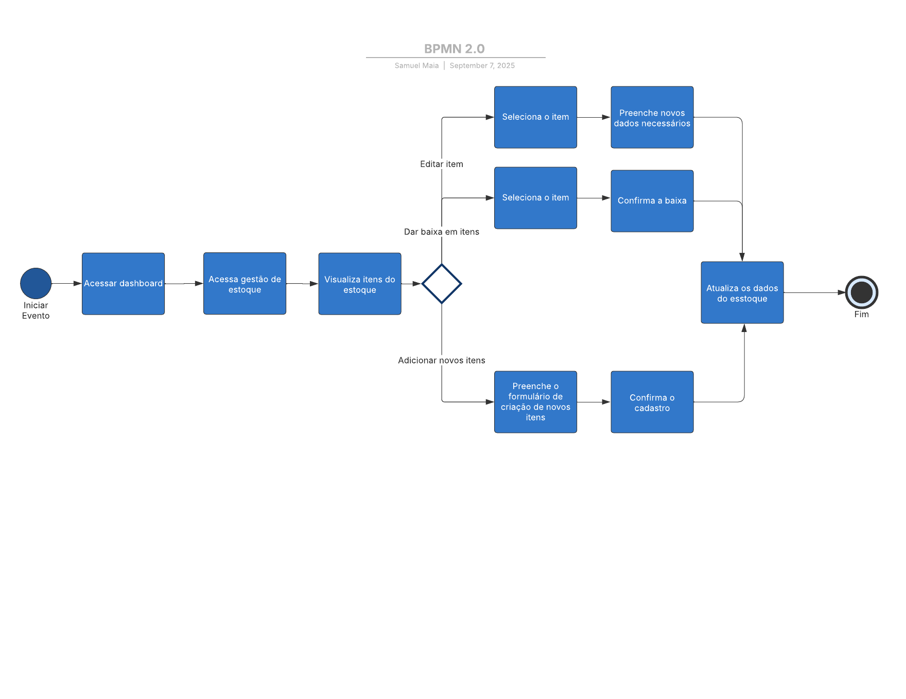
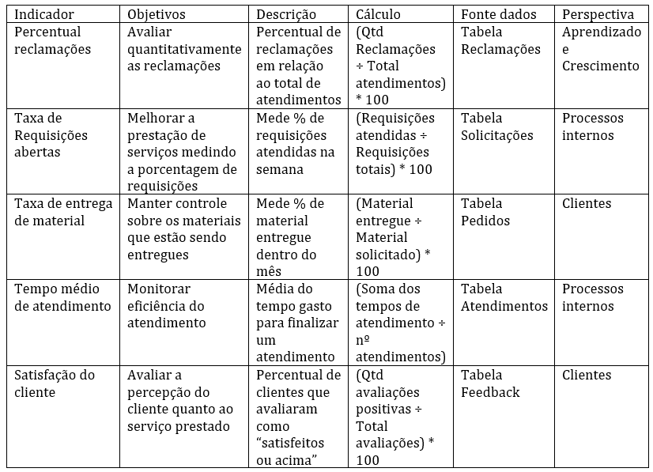
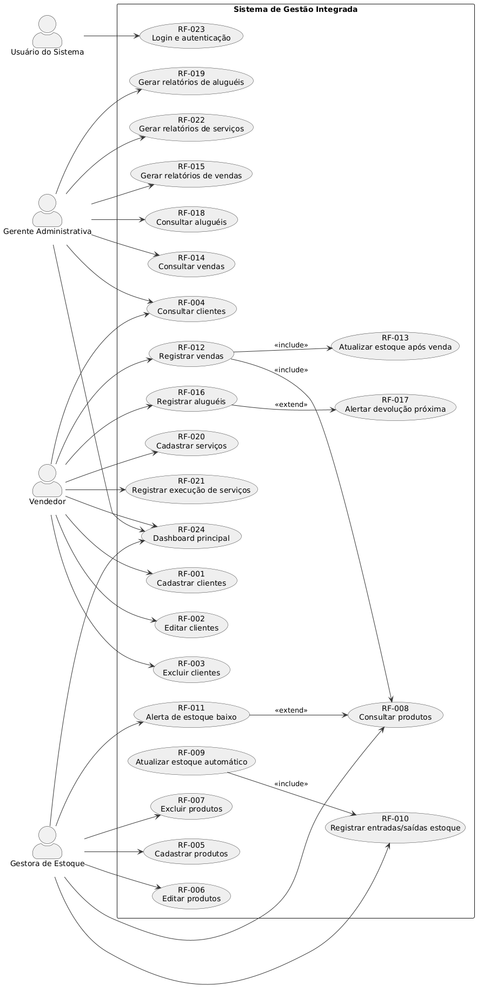

# Especificações do Projeto

Pré-requisitos: <a href="1-Documentação de Contexto.md"> Documentação de Contexto</a>

Definição do problema e ideia de solução a partir da perspectiva do usuário. É composta pela definição do  diagrama de personas, histórias de usuários, requisitos funcionais e não funcionais além das restrições do projeto.

Apresente uma visão geral do que será abordado nesta parte do documento, enumerando as técnicas e/ou ferramentas utilizadas para realizar a especificações do projeto

## Personas

Persona 1 - Gerente Administrativa

Maria Silva tem 32 anos, é gerente administrativa em uma empresa de distrubuição de bebidas. Trabalha há mais de 7 anos no setor e é responsável por cuidar do fluxo de estoque, movimentação de produtos e relatórios de vendas. Gosta de ter tudo sob controle e precisa de uma visão geral para tomar decisões rápidas. É casada, tem uma filha de 4 anos e gosta de ferramentas que economizam tempo e evitam retrabalho. Ela busca uma solução que mostre um resumo das operações, ajude a identificar problemas no estoque e possibilite acompanhar o desempenho da equipe.

Persona 2 - Vendedor

Carlos Henrique tem 27 anos, é vendedor em uma loja de eletrônicos há 2 anos. É o responsável por cadastrar novos clientes, registrar pedidos e acompanhar o andamento das vendas. É comunicativo, gosta de tecnologia e sempre procura formas de agilizar suas tarefas diárias. Solteiro, nas horas vagas joga online com amigos e acompanha canais de tecnologia. Ele precisa de uma solução rápida e prática, que evite erros na hora de cadastrar clientes e pedidos, e que facilite a comunicação entre vendas e estoque para evitar atrasos ou problemas de disponibilidade.

Persona 3 -  Gestora de Estoque

Juliana Rocha tem 40 anos, é gestora de estoque em uma empresa de cosméticos. Trabalha com logística há mais de 15 anos e conhece bem os desafios de organizar e controlar grandes volumes de mercadorias. É detalhista, organizada e tem como prioridade manter o estoque sempre atualizado e confiável. Mãe de dois adolescentes, Juliana gosta de processos claros e ferramentas que ajudem a prevenir falhas. Ela procura um sistema que permita acompanhar entradas e saídas em tempo real, gerar relatórios de inventário e reduzir erros, para manter o fluxo de produtos estável e ajudar a equipe de vendas.

## Histórias de Usuários

Com base na análise das personas forma identificadas as seguintes histórias de usuários:

|EU COMO... `PERSONA`| QUERO/PRECISO ... `FUNCIONALIDADE` |PARA ... `MOTIVO/VALOR`                 |
|--------------------|------------------------------------|----------------------------------------|
|Gerente Administrativa   | Visualizar resumo de vendas e estoque   | Acompanhar desempenho geral da empresa            |
|Gerente Administrativa  | Gerar relatórios           | Identificar problemas e controlar a eficiência              |
|Gerente Administrativa       | Gerenciar contas                 | Garantir que o funcionário só veja as informações do próprio trabalho |
|Vendedor     | Consultar a disponibilidade dos produtos             | Evitar oferecer itens que não estejam em estoque |
|Gestora de estoque       | Registrar a entrada e saída de produtos | Manter o controle e organização dos produtos |
|Gestora de estoque       | Receber alertas de produtos com baixo estoque | Fazer a reposição dos produtos faltantes |

## Modelagem do Processo de Negócio 

### Análise da Situação Atual

Atualmente, muitas empresas enfrentam dificuldades na gestão integrada de suas operações administrativas. Os processos existentes apresentam algumas limitações, tais como:

- Controle de estoque manual ou disperso: Os registros de entrada e saída de produtos são realizados em planilhas ou cadernos, tornando o acompanhamento do estoque impreciso e sujeito a erros.

- Gestão de vendas e aluguéis desorganizada: A emissão de vendas e aluguéis é feita de forma manual, o que pode gerar duplicidade de informações e atrasos nos relatórios financeiros.

- Dificuldade no gerenciamento de serviços e tarefas: Os serviços prestados e tarefas internas não possuem um registro centralizado, dificultando a supervisão e acompanhamento da produtividade da equipe.

- Controle financeiro fragmentado: Gastos e receitas não são consolidados em uma única plataforma, aumentando a chance de erros e dificultando a análise completa da saúde financeira da empresa.

No modelo atual, cada tarefa é executada de forma isolada, utilizando ferramentas diversas (papel, planilhas, softwares específicos não integrados), o que gera retrabalho, baixa eficiência e risco de inconsistência de dados.

### Descrição Geral da Proposta

O sistema proposto neste projeto visa integrar todas essas operações em um único dashboard administrativo, oferecendo uma visão completa da empresa, melhorando a produtividade, precisão e tomada de decisão. Com isso, é possível automatizar processos como controle de estoque, emissão de vendas e aluguéis, registro de serviços e gestão financeira.

### Processo 1 – Cadastro de vendas e aluguéis

O processo de vendas e aluguéis atualmente é realizado de forma manual ou com sistemas não integrados, o que gera duplicidade de informações, atrasos na emissão de notas ou contratos e dificuldade de acompanhamento financeiro.

Para o processo de cadastro de vendas e aluguéis, apontamos as seguintes possíveis melhorias:
- Centralizar registros de vendas e aluguéis em um único sistema.
- Automatizar a geração de contratos e comprovantes de pagamento.
- Integrar vendas/aluguéis com estoque e financeiro.

### Processo 2 – Gestão de estoque

O processo de gestão de estoque atualmente apresenta problemas como registros manuais, dificuldade de controle em tempo real e falta de integração com outros setores, como vendas e compras. Essas limitações podem gerar erros de inventário, produtos em falta ou excesso e retrabalho na conferência de dados.

Para o processo de gestão de estoque, apontamos as seguintes possíveis melhorias:
- Integrar o estoque com o módulo de vendas e compras.
- Gerar alertas automáticos para produtos com baixa quantidade.

## Indicadores de Desempenho

## Requisitos

As tabelas que se seguem apresentam os requisitos funcionais e não funcionais que detalham o escopo do projeto. Para determinar a prioridade de requisitos, aplicar uma técnica de priorização de requisitos e detalhar como a técnica foi aplicada.

### Requisitos Funcionais

| ID     | Descrição do Requisito                                                                       | Prioridade |
| ------ | -------------------------------------------------------------------------------------------- | ---------- |
| RF-001 | Cadastrar novos clientes com nome, CPF/CNPJ, endereço, telefone e e-mail                     | Alta       |
| RF-002 | Editar informações de clientes existentes                                                    | Média      |
| RF-003 | Excluir clientes                                                                             | Média      |
| RF-004 | Consultar lista de clientes com filtros (nome, CPF/CNPJ, status)                             | Média      |
| RF-005 | Cadastrar produtos com nome, descrição, categoria, preço, quantidade em estoque e fornecedor | Alta       |
| RF-006 | Editar produtos existentes                                                                   | Alta       |
| RF-007 | Excluir produtos                                                                             | Média      |
| RF-008 | Consultar produtos com filtros por nome, categoria, preço ou estoque                         | Alta       |
| RF-009 | Atualizar automaticamente a quantidade em estoque após vendas ou aluguéis                    | Alta       |
| RF-010 | Registrar entradas e saídas de estoque                                                       | Alta       |
| RF-011 | Alertar quando um produto estiver com estoque baixo                                          | Média      |
| RF-012 | Registrar uma venda com cliente, produtos, quantidade, preço unitário e total                | Alta       |
| RF-013 | Atualizar o estoque automaticamente após a venda                                             | Alta       |
| RF-014 | Consultar vendas por cliente, data ou produto                                                | Média      |
| RF-015 | Gerar relatórios de vendas (diário, semanal, mensal)                                         | Baixa      |
| RF-016 | Registrar um aluguel com cliente, produto, data de início, data de término e valor           | Alta       |
| RF-017 | Gerar alertas de devolução próxima do prazo                                                  | Média      |
| RF-018 | Consultar aluguéis ativos, finalizados ou atrasados                                          | Média      |
| RF-019 | Gerar relatórios de aluguéis (ativos, finalizados, faturamento)                              | Baixa      |
| RF-020 | Cadastrar serviços com nome, descrição, preço e duração                                      | Média      |
| RF-021 | Registrar execução de um serviço para um cliente                                             | Alta       |
| RF-022 | Gerar relatórios de serviços prestados                                                       | Baixa      |
| RF-023 | Login e autenticação de usuários                                                             | Alta       |
| RF-024 | Dashboard principal com gráficos e indicadores de vendas, aluguéis, estoque e serviços       | Alta       |

### Requisitos não Funcionais

| ID      | Descrição do Requisito                                                                    | Prioridade |
| ------- | ----------------------------------------------------------------------------------------- | ---------- |
| RNF-001 | Compatibilidade com Android e iOS, suportando versões recentes e duas anteriores          | Alta       |
| RNF-002 | Responsivo, adaptando-se a diferentes tamanhos de tela e resoluções                       | Alta       |
| RNF-003 | Tempo de resposta das telas inferior a 2 segundos                                         | Alta       |
| RNF-004 | Funcionamento offline parcial com sincronização automática                                | Média      |
| RNF-005 | Consumo de dados otimizado                                                                | Média      |
| RNF-006 | Armazenamento seguro de dados sensíveis, criptografia de senhas e informações pessoais    | Alta       |
| RNF-007 | Autenticação segura, incluindo biometria (impressão digital ou facial)                    | Média      |
| RNF-008 | Interface intuitiva e fácil de usar, elementos touch-friendly                             | Alta       |
| RNF-009 | Registro de logs de atividades essenciais, respeitando a privacidade                      | Média      |
| RNF-010 | Suporte a múltiplos usuários com diferentes perfis e permissões                           | Alta       |
| RNF-011 | Uso eficiente de bateria e memória, evitando travamentos                                  | Média      |
| RNF-012 | Disponibilidade contínua mesmo com interrupções de rede, garantindo integridade dos dados | Alta       |

## Restrições

O projeto está restrito pelos itens apresentados na tabela a seguir.

| ID | Restrição                                                                                                        |
| -- | ---------------------------------------------------------------------------------------------------------------- |
| 01 | O projeto deverá ser desenvolvido como aplicativo mobile para Android e iOS                                      |
| 02 | Não é permitido uso de frameworks pagos para componentes essenciais do app                                       |
| 03 | O desenvolvimento deverá priorizar segurança e proteção de dados sensíveis (senhas, CPF/CNPJ, dados financeiros) |
| 04 | O sistema deve ser compatível com versões mínimas dos sistemas operacionais definidas (Android e iOS)            |
| 05 | O projeto deve ser entregue dentro do prazo definido no cronograma de desenvolvimento                            |
| 06 | O app deve ser otimizado para não consumir excessivamente bateria ou memória dos dispositivos                    |
| 07 | A interface deve ser desenvolvida apenas para dispositivos móveis, sem versão web completa                       |

## Diagrama de Casos de Uso

O diagrama de casos de uso é o próximo passo após a elicitação de requisitos, que utiliza um modelo gráfico e uma tabela com as descrições sucintas dos casos de uso e dos atores. Ele contempla a fronteira do sistema e o detalhamento dos requisitos funcionais com a indicação dos atores, casos de uso e seus relacionamentos. 

As referências abaixo irão auxiliá-lo na geração do artefato “Diagrama de Casos de Uso”.

> **Links Úteis**:
> - [Criando Casos de Uso](https://www.ibm.com/docs/pt-br/elm/6.0?topic=requirements-creating-use-cases)
> - [Como Criar Diagrama de Caso de Uso: Tutorial Passo a Passo](https://gitmind.com/pt/fazer-diagrama-de-caso-uso.html/)
> - [Lucidchart](https://www.lucidchart.com/)
> - [Astah](https://astah.net/)
> - [Diagrams](https://app.diagrams.net/)

# Matriz de Rastreabilidade

A matriz de rastreabilidade é uma ferramenta usada para facilitar a visualização dos relacionamento entre requisitos e outros artefatos ou objetos, permitindo a rastreabilidade entre os requisitos e os objetivos de negócio. 

| ID      | Descrição                                                                                    | Tipo          | Prioridade | Rastreabilidade                                   |
| ------- | -------------------------------------------------------------------------------------------- | ------------- | ---------- | ------------------------------------------------- |
| RNF-001 | Compatibilidade com Android e iOS, suportando versões recentes e duas anteriores             | Não Funcional | Alta       | R04, R03                                          |
| RNF-002 | Responsivo, adaptando-se a diferentes tamanhos de tela e resoluções                          | Não Funcional | Alta       | RF-001, RF-005, RF-008, RF-012, RF-016            |
| RNF-003 | Tempo de resposta das telas inferior a 2 segundos                                            | Não Funcional | Alta       | RF-001 a RF-024                                   |
| RNF-004 | Funcionamento offline parcial com sincronização automática                                   | Não Funcional | Média      | RF-001 a RF-024                                   |
| RNF-005 | Consumo de dados otimizado                                                                   | Não Funcional | Média      | RF-001 a RF-024                                   |
| RNF-006 | Armazenamento seguro de dados sensíveis, criptografia de senhas e informações pessoais       | Não Funcional | Alta       | RF-001, RF-012, RF-016, RF-021, R03, R04          |
| RNF-007 | Autenticação segura, incluindo biometria (impressão digital ou facial)                       | Não Funcional | Média      | RF-023                                            |
| RNF-008 | Interface intuitiva e fácil de usar, elementos touch-friendly                                | Não Funcional | Alta       | RF-001 a RF-024                                   |
| RNF-009 | Registro de logs de atividades essenciais, respeitando a privacidade                         | Não Funcional | Média      | RF-001 a RF-024                                   |
| RNF-010 | Suporte a múltiplos usuários com diferentes perfis e permissões                              | Não Funcional | Alta       | RF-023                                            |
| RNF-011 | Uso eficiente de bateria e memória, evitando travamentos                                     | Não Funcional | Média      | RF-001 a RF-024                                   |
| RNF-012 | Disponibilidade contínua mesmo com interrupções de rede, garantindo integridade dos dados    | Não Funcional | Alta       | RF-001 a RF-024                                   |
| RF-001  | Cadastrar novos clientes com nome, CPF/CNPJ, endereço, telefone e e-mail                     | Funcional     | Alta       | Caso de uso: cadastrar clientes                   |
| RF-002  | Editar informações de clientes existentes                                                    | Funcional     | Média      | Caso de uso: editar clientes                      |
| RF-003  | Excluir clientes                                                                             | Funcional     | Média      | Caso de uso: editar clientes                      |
| RF-004  | Consultar lista de clientes com filtros (nome, CPF/CNPJ, status)                             | Funcional     | Média      | Caso de uso: consultar clientes                   |
| RF-005  | Cadastrar produtos com nome, descrição, categoria, preço, quantidade em estoque e fornecedor | Funcional     | Alta       | Caso de uso: registrar vendas/aluguéis            |
| RF-006  | Editar produtos existentes                                                                   | Funcional     | Alta       | Caso de uso: registrar vendas/aluguéis            |
| RF-007  | Excluir produtos                                                                             | Funcional     | Média      | Caso de uso: registrar vendas/aluguéis            |
| RF-008  | Consultar produtos com filtros por nome, categoria, preço ou estoque                         | Funcional     | Alta       | Caso de uso: consultar vendas/aluguéis            |
| RF-009  | Atualizar automaticamente a quantidade em estoque após vendas ou aluguéis                    | Funcional     | Alta       | RF-012, RF-016                                    |
| RF-010  | Registrar entradas e saídas de estoque                                                       | Funcional     | Alta       | RF-012, RF-016                                    |
| RF-011  | Alertar quando um produto estiver com estoque baixo                                          | Funcional     | Média      | RF-012, RF-016                                    |
| RF-012  | Registrar uma venda com cliente, produtos, quantidade, preço unitário e total                | Funcional     | Alta       | Caso de uso: registrar vendas                     |
| RF-013  | Atualizar o estoque automaticamente após a venda                                             | Funcional     | Alta       | RF-012, RF-009                                    |
| RF-014  | Consultar vendas por cliente, data ou produto                                                | Funcional     | Média      | Caso de uso: consultar vendas                     |
| RF-015  | Gerar relatórios de vendas (diário, semanal, mensal)                                         | Funcional     | Baixa      | Caso de uso: gerar relatório de vendas            |
| RF-016  | Registrar um aluguel com cliente, produto, data de início, data de término e valor           | Funcional     | Alta       | Caso de uso: registrar aluguéis                   |
| RF-017  | Gerar alertas de devolução próxima do prazo                                                  | Funcional     | Média      | Caso de uso: consultar aluguéis                   |
| RF-018  | Consultar aluguéis ativos, finalizados ou atrasados                                          | Funcional     | Média      | Caso de uso: consultar aluguéis                   |
| RF-019  | Gerar relatórios de aluguéis (ativos, finalizados, faturamento)                              | Funcional     | Baixa      | Caso de uso: gerar relatório de serviços          |
| RF-020  | Cadastrar serviços com nome, descrição, preço e duração                                      | Funcional     | Média      | Caso de uso: registrar serviços                   |
| RF-021  | Registrar execução de um serviço para um cliente                                             | Funcional     | Alta       | Caso de uso: registrar serviços                   |
| RF-022  | Gerar relatórios de serviços prestados                                                       | Funcional     | Baixa      | Caso de uso: gerar relatório de serviços          |
| RF-023  | Login e autenticação de usuários                                                             | Funcional     | Alta       | Caso de uso: login e autenticação                 |
| RF-024  | Dashboard principal com gráficos e indicadores de vendas, aluguéis, estoque e serviços       | Funcional     | Alta       | Caso de uso: gerar relatório de vendas e serviços |

# Gerenciamento de Projeto

De acordo com o PMBoK v6 as dez áreas que constituem os pilares para gerenciar projetos, e que caracterizam a multidisciplinaridade envolvida, são: Integração, Escopo, Cronograma (Tempo), Custos, Qualidade, Recursos, Comunicações, Riscos, Aquisições, Partes Interessadas. Para desenvolver projetos um profissional deve se preocupar em gerenciar todas essas dez áreas. Elas se complementam e se relacionam, de tal forma que não se deve apenas examinar uma área de forma estanque. É preciso considerar, por exemplo, que as áreas de Escopo, Cronograma e Custos estão muito relacionadas. Assim, se eu amplio o escopo de um projeto eu posso afetar seu cronograma e seus custos.

## Gerenciamento de Tempo

Com diagramas bem organizados que permitem gerenciar o tempo nos projetos, o gerente de projetos agenda e coordena tarefas dentro de um projeto para estimar o tempo necessário de conclusão.

O gráfico de Gantt ou diagrama de Gantt também é uma ferramenta visual utilizada para controlar e gerenciar o cronograma de atividades de um projeto. Com ele, é possível listar tudo que precisa ser feito para colocar o projeto em prática, dividir em atividades e estimar o tempo necessário para executá-las.

## Gerenciamento de Equipe

O gerenciamento adequado de tarefas contribuirá para que o projeto alcance altos níveis de produtividade. Por isso, é fundamental que ocorra a gestão de tarefas e de pessoas, de modo que os times envolvidos no projeto possam ser facilmente gerenciados. 

## Gestão de Orçamento

O processo de determinar o orçamento do projeto é uma tarefa que depende, além dos produtos (saídas) dos processos anteriores do gerenciamento de custos, também de produtos oferecidos por outros processos de gerenciamento, como o escopo e o tempo.

