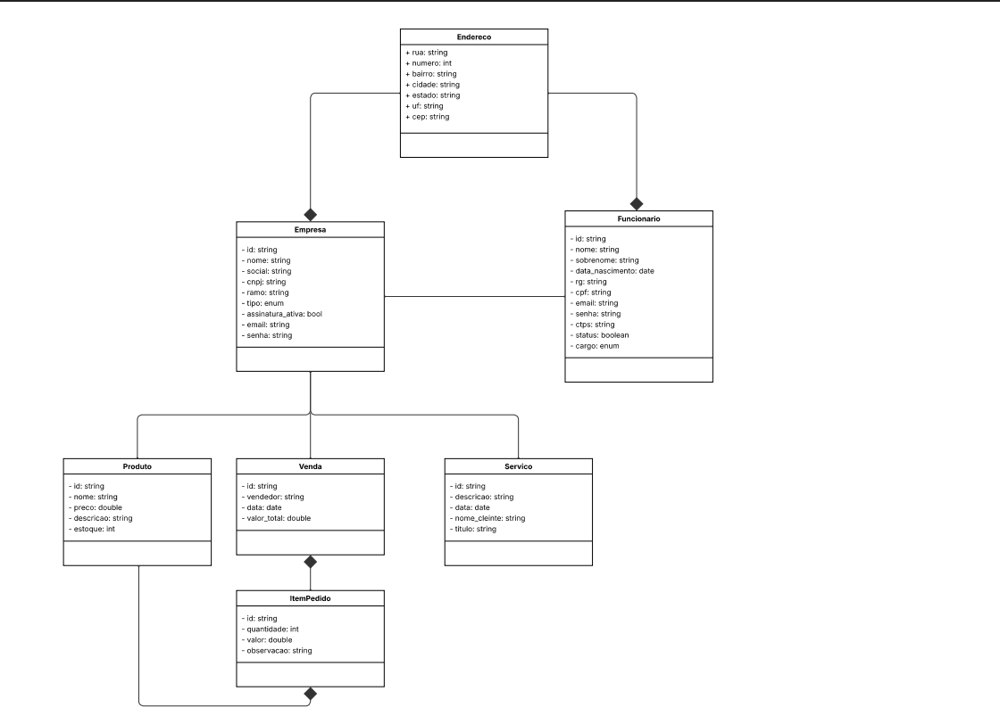
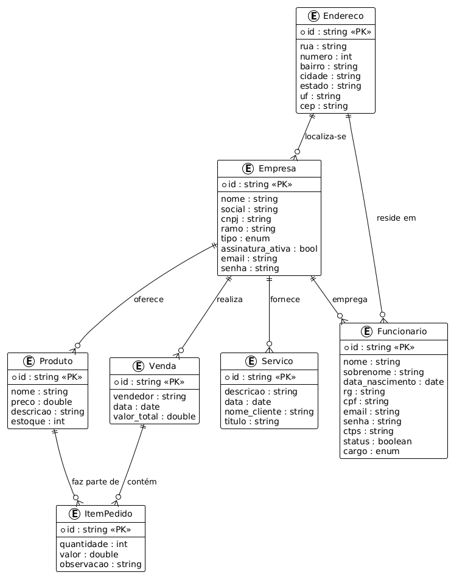

# Arquitetura da Solução

<span style="color:red">Pré-requisitos: <a href="3-Projeto de Interface.md"> Projeto de Interface</a></span>

Definição de como o software é estruturado em termos dos componentes que fazem parte da solução e do ambiente de hospedagem da aplicação.


## Diagrama de Classes



## Modelo ER



## Modelo Físico

```
// ================== COLEÇÃO EMPRESA ==================
db.createCollection("empresas")
db.empresas.insertOne({
  _id: ObjectId(),
  nome: "Tech Solutions",
  social: "Tech Solutions LTDA",
  cnpj: "12.345.678/0001-90",
  ramo: "Tecnologia",
  tipo: "Privada",
  assinatura_ativa: true,
  email: "contato@tech.com",
  senha: "123456",
  endereco: {
    rua: "Av. Paulista",
    numero: 1000,
    bairro: "Centro",
    cidade: "São Paulo",
    estado: "SP",
    uf: "SP",
    cep: "01310-100"
  }
})

// ================== COLEÇÃO FUNCIONARIO ==================
db.createCollection("funcionarios")
db.funcionarios.insertOne({
  _id: ObjectId(),
  empresa_id: ObjectId("..."), // referência empresa
  nome: "João",
  sobrenome: "Silva",
  data_nascimento: ISODate("1990-05-10"),
  rg: "12.345.678-9",
  cpf: "123.456.789-00",
  email: "joao@tech.com",
  senha: "senha123",
  ctps: "1234567",
  status: true,
  cargo: "Gerente",
  endereco: {
    rua: "Rua A",
    numero: 45,
    bairro: "Bela Vista",
    cidade: "São Paulo",
    estado: "SP",
    uf: "SP",
    cep: "01311-000"
  }
})

// ================== COLEÇÃO PRODUTO ==================
db.createCollection("produtos")
db.produtos.insertOne({
  _id: ObjectId(),
  empresa_id: ObjectId("..."), // referência empresa
  nome: "Notebook Dell",
  preco: 4500.00,
  descricao: "Notebook i7 16GB RAM",
  estoque: 20
})

// ================== COLEÇÃO SERVIÇO ==================
db.createCollection("servicos")
db.servicos.insertOne({
  _id: ObjectId(),
  empresa_id: ObjectId("..."), // referência empresa
  descricao: "Manutenção de servidor",
  data: ISODate("2025-09-28"),
  nome_cliente: "Empresa X",
  titulo: "Contrato de suporte"
})

// ================== COLEÇÃO VENDAS ==================
db.createCollection("vendas")
db.vendas.insertOne({
  _id: ObjectId(),
  empresa_id: ObjectId("..."),     // referência empresa
  vendedor_id: ObjectId("..."),    // referência funcionário
  data: ISODate("2025-09-28"),
  valor_total: 9000.00,
  itens: [
    {
      produto_id: ObjectId("..."), // referência produto
      quantidade: 2,
      valor: 4500.00,
      observacao: "Entrega em 7 dias"
    }
  ]
})
```
## Tecnologias Utilizadas

Descreva aqui qual(is) tecnologias você vai usar para resolver o seu problema, ou seja, implementar a sua solução. Liste todas as tecnologias envolvidas, linguagens a serem utilizadas, serviços web, frameworks, bibliotecas, IDEs de desenvolvimento, e ferramentas.

Apresente também uma figura explicando como as tecnologias estão relacionadas ou como uma interação do usuário com o sistema vai ser conduzida, por onde ela passa até retornar uma resposta ao usuário.

| **Dimensão**   | **Tecnologia**  |
| ---            | ---             |
| SGBD           | MongoDB         |
| Front end      | JS+React        |
| Back end       | Node+Express    |
| Deploy Front   | Vercel          |
| ORM            | Mongoose        |
| Deploy Back    | Render          |
| API Externa    | Google Maps     |
| API Externa    | ViaCEP          |

## Hospedagem

Explique como a hospedagem e o lançamento da plataforma foi feita.

> **Links Úteis**:
>
> - [Website com GitHub Pages](https://pages.github.com/)
> - [Programação colaborativa com Repl.it](https://repl.it/)
> - [Getting Started with Heroku](https://devcenter.heroku.com/start)
> - [Publicando Seu Site No Heroku](http://pythonclub.com.br/publicando-seu-hello-world-no-heroku.html)

## Qualidade de Software

Conceituar qualidade de fato é uma tarefa complexa, mas ela pode ser vista como um método gerencial que através de procedimentos disseminados por toda a organização, busca garantir um produto final que satisfaça às expectativas dos stakeholders.

No contexto de desenvolvimento de software, qualidade pode ser entendida como um conjunto de características a serem satisfeitas, de modo que o produto de software atenda às necessidades de seus usuários. Entretanto, tal nível de satisfação nem sempre é alcançado de forma espontânea, devendo ser continuamente construído. Assim, a qualidade do produto depende fortemente do seu respectivo processo de desenvolvimento.

A norma internacional ISO/IEC 25010, que é uma atualização da ISO/IEC 9126, define oito características e 30 subcaracterísticas de qualidade para produtos de software.
Com base nessas características e nas respectivas sub-características, identifique as sub-características que sua equipe utilizará como base para nortear o desenvolvimento do projeto de software considerando-se alguns aspectos simples de qualidade. Justifique as subcaracterísticas escolhidas pelo time e elenque as métricas que permitirão a equipe avaliar os objetos de interesse.

> **Links Úteis**:
>
> - [ISO/IEC 25010:2011 - Systems and software engineering — Systems and software Quality Requirements and Evaluation (SQuaRE) — System and software quality models](https://www.iso.org/standard/35733.html/)
> - [Análise sobre a ISO 9126 – NBR 13596](https://www.tiespecialistas.com.br/analise-sobre-iso-9126-nbr-13596/)
> - [Qualidade de Software - Engenharia de Software 29](https://www.devmedia.com.br/qualidade-de-software-engenharia-de-software-29/18209/)
